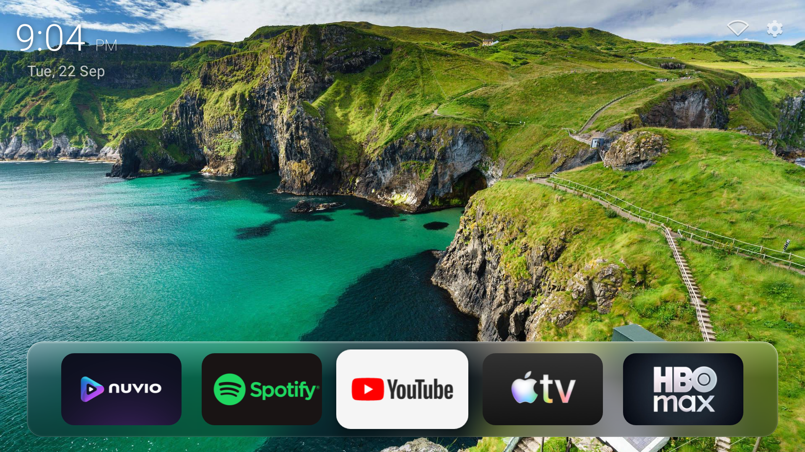
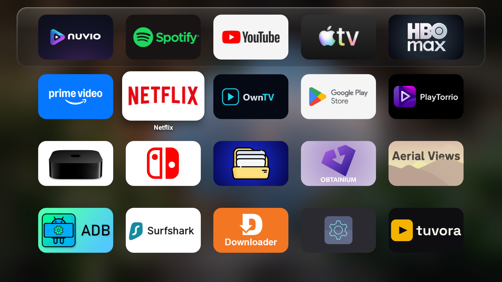
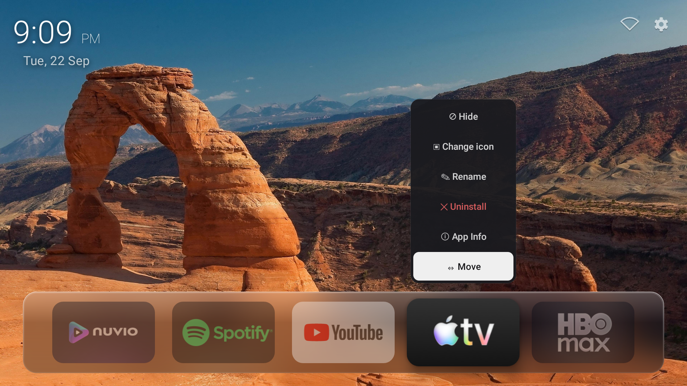
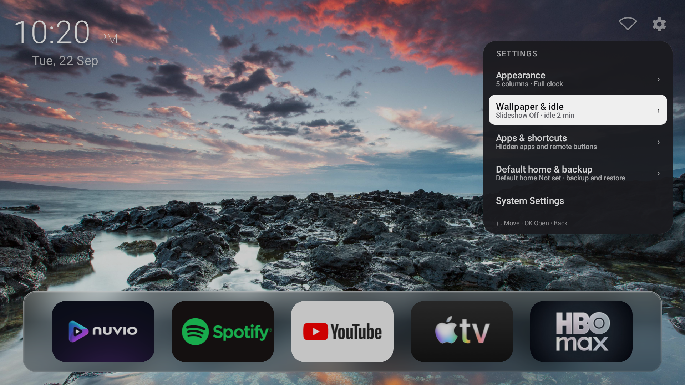

<div align="center">


# BareLauncher

**A small, local-first home screen for Android TV, Google TV, and Fire TV.**

[](https://github.com/namillis/barelauncher/releases/latest)
[](https://github.com/namillis/barelauncher/releases/latest/download/BareLauncher.apk)
[](http://aftv.news/9049616)
[](./LICENSE)

</div>

## Why BareLauncher

Stock TV home screens mix app launching with content feeds and storefronts. BareLauncher focuses on one job: press Home, choose an app, and get out of the way.

The home screen shows your wallpaper, clock, and one row of favorite apps. Press Down for the complete app grid. Settings and customization stay out of sight until you need them. There are no ads, recommendations, accounts, or telemetry.

## Screenshots

<sub><i>Click an image to open it at full size.</i></sub>

<div align="center">
<table>
  <tr>
    <td align="center">
      <a href="docs/screenshots/home.png">
        
      </a><br/><sub><b>Home</b></sub>
    </td>
    <td align="center">
      <a href="docs/screenshots/app-grid.png">
        
      </a><br/><sub><b>App grid</b></sub>
    </td>
  </tr>
  <tr>
    <td align="center">
      <a href="docs/screenshots/app-options.png">
        
      </a><br/><sub><b>Reorder &amp; manage</b></sub>
    </td>
    <td align="center">
      <a href="docs/screenshots/settings-menu.png">
        
      </a><br/><sub><b>Settings</b></sub>
    </td>
  </tr>
</table>
</div>

## What it does

- **Favorites and app grid:** Keep the apps you use most on the home screen and open the full grid with one press. Reorder or hide entries with the remote.
- **App customization:** Long-press an app to rename it, choose custom artwork, move it, hide it, open App info, or uninstall it.
- **Appearance controls:** Choose 4 to 7 icons per row, icon roundness, focus border and color, and whether the clock shows the date, time only, or nothing.
- **Wallpapers and slideshows:** Use a single wallpaper or rotate through an image folder. Configure idle mode to hide the launcher UI and leave the wallpaper and clock visible.
- **Remote and TV controls:** Add supported HDMI and other TV inputs to the grid. Assign the remote's color, menu, and subtitle buttons to apps.
- **Backup and restore:** Export the launcher layout and settings to a file, then restore them after reinstalling or moving to another device.
- **Persistent Google TV Home:** An optional one-time local ADB setup makes BareLauncher the Home app and includes a restore action for Google TV Home.

## Privacy and size

Normal launcher use makes no network requests. BareLauncher has no analytics, advertising, account system, or background update service. Custom names, artwork, shortcuts, and settings stay on the device.

The APK includes the `INTERNET` permission only for the explicit Google TV Home setup. That flow connects to the TV's own ADB daemon at `127.0.0.1:5555` and runs a fixed set of setup or restore commands. Photo access is requested only when you choose a slideshow folder.

The UI uses the Android SDK directly, with programmatic layouts and custom recycling views. It has no runtime AndroidX dependency or native code. R8 minifies each release. The only direct production dependency is `dadb`, which is loaded for the local ADB setup and restore flow.

## Compatibility

BareLauncher requires Android 8.0 (API 26) or newer. It is intended for:

- Android TV and Google TV devices
- Fire TV Stick and Fire TV Cube
- Mi Box, Mi Stick, and other Android TV boxes

TV input tiles depend on the device exposing inputs through Android's TV Input Framework. The built-in persistent Home setup is for Google TV devices with local ADB available on port 5555. Other devices use their system launcher-selection flow.

## Install

BareLauncher is sideload-only. It is not published on the Google Play Store or Amazon Appstore.

### Downloader

Install the **Downloader** app by AFTVnews and enter code **9049616**. The code points to the latest BareLauncher release.

### Direct APK

1. Download [`BareLauncher.apk`](https://github.com/namillis/barelauncher/releases/latest/download/BareLauncher.apk) from the latest release.
2. Move it to the TV with a USB drive, network share, or file-transfer app.
3. Allow installation from unknown sources when Android asks.
4. Open the APK and install it.

## Use BareLauncher as Home on Google TV

After Network debugging is enabled, BareLauncher configures the TV without a second device:

1. Enable **Developer options**, then enable **Network debugging**.
2. Open **Settings → Default home & backup → Default home** in BareLauncher.
3. Select **Use BareLauncher as Home**.
4. Accept Android's one-time debugging authorization prompt.

The setup selects BareLauncher as the system Home app and disables the Google TV launcher packages. The change survives normal restarts.

Disabling Google TV Home also removes its quick-settings sidebar. Before uninstalling BareLauncher, use **Restore Google TV Home** from the same screen. If BareLauncher has already been removed, reconnect with ADB and run:

```shell
adb shell pm enable --user 0 com.google.android.apps.tv.launcherx
adb shell pm enable --user 0 com.google.android.tungsten.setupwraith
```

## License

BareLauncher is available under the **PolyForm Noncommercial License 1.0.0** for personal and non-commercial use. See [LICENSE](./LICENSE) and [NOTICE.md](./NOTICE.md).
